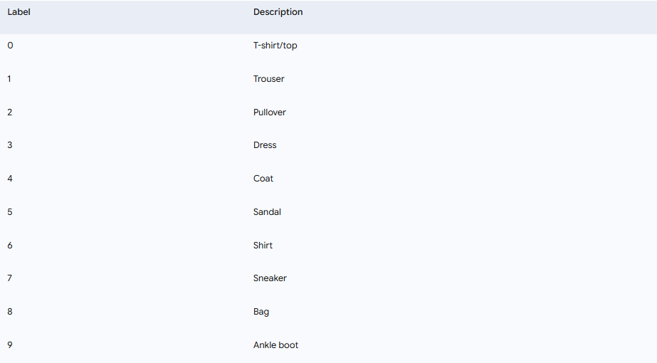
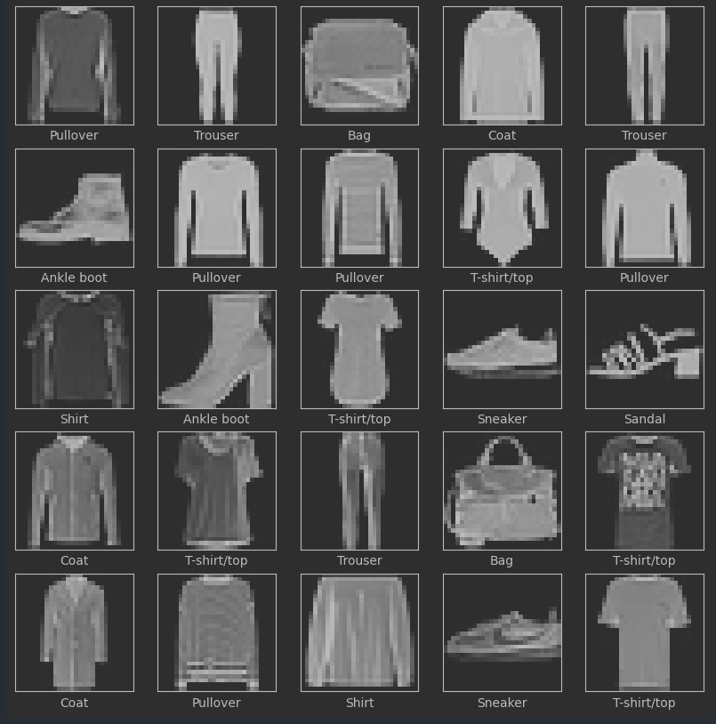
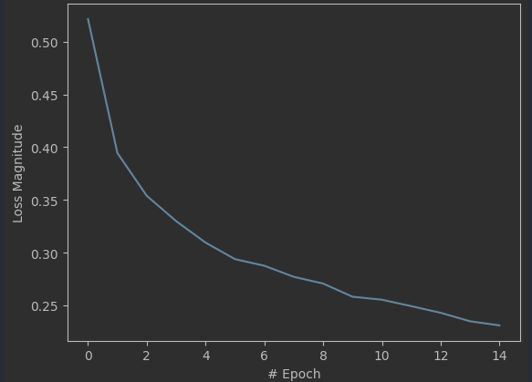
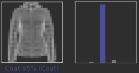
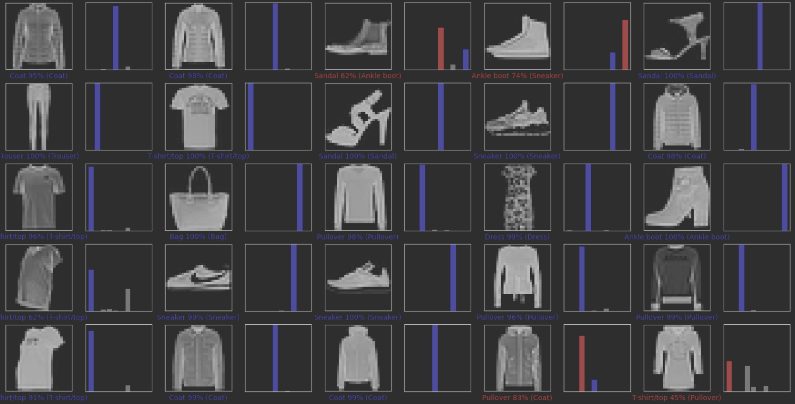

# Dense Neural Network for Fashion Classification (Fashion MNIST)

This project implements a dense neural network using TensorFlow and Keras to classify clothing items from the popular **Fashion MNIST dataset by Zalando**.

## 🎯 The Problem

The objective is to train a machine learning model capable of correctly identifying which clothing category a 28x28 pixel grayscale image belongs to. The Fashion MNIST dataset contains 70,000 images divided into 10 different categories.

It is a more complex image classification problem than the classic MNIST handwritten digits and serves as an excellent starting point for computer vision problems.

### The 10 Clothing Categories

The model must classify the images into one of the following 10 classes


Here is a sample of what the images in the dataset look like:


## 🧠 The Solution: A Dense Neural Network
To solve this problem, a sequential neural network model is built and trained with the following characteristics:

### 1. Data Preparation
Before training, the image data (pixels with values from 0 to 255) is normalized to have values between 0 and 1. This helps the network learn faster and more efficiently.

```python
# Normalization function
def normalize(images, labels):
  images = tf.cast(images, tf.float32)
  images /= 255 # Converts values from 0-255 to 0-1
  return images, labels

# Apply normalization to the data
training_data = training_data.map(normalize)
test_data = test_data.map(normalize)
```
### 2. Model Architecture
The model consists of four layers:

1. **Flatten Layer**: Converts the 28x28 pixel images into a one-dimensional vector of 784 pixels.

2. **Two Dense Hidden Layers**: Two dense layers with 50 neurons each and a ReLU activation function. These layers are responsible for finding complex patterns in the data.

3. **Output Dense Layer**: A final layer with 10 neurons (one for each class) and a Softmax activation function, which returns an array of probabilities indicating which class the image belongs to.

```python
# Create the model
model = tf.keras.Sequential([
  tf.keras.layers.Flatten(input_shape=(28,28,1)), # Input layer
  tf.keras.layers.Dense(50, activation=tf.nn.relu),  # Hidden layer 1
  tf.keras.layers.Dense(50, activation=tf.nn.relu),  # Hidden layer 2
  tf.keras.layers.Dense(10, activation=tf.nn.softmax) # Output layer
])
```
### 3. Training
The model is compiled using the adam optimizer and the SparseCategoricalCrossentropy loss function, which is ideal for classification problems. It is trained for **15 epochs** using **batches of 32 images**.

## 📈 Results
After training, we evaluate the model's performance.

### Loss Curve
The following graph shows how the model's loss magnitude (error) decreased throughout the 15 training epochs. A downward curve indicates that the model is learning correctly.

```python
# View the loss function
plt.xlabel("# Epoch")
plt.ylabel("Loss Magnitude")
plt.plot(history.history["loss"])
```
### Model Predictions
Finally, we can see the model in action. The following image shows the predictions for a set of test images.

- Labels in **blue** indicate a **correct prediction**.

- Labels in **red** indicate an **incorrect prediction**.

Next to each image, the predicted label, the confidence percentage, and the actual label (in parentheses) are displayed. To the right, a bar chart shows the probabilities for each of the 10 classes.
```python
# Plot a grid with several predictions
rows = 5
cols = 5
num_images = rows*cols
plt.figure(figsize=(2*2*cols, 2*rows))
for i in range(num_images):
  plt.subplot(rows, 2*cols, 2*i+1)
  plot_image(i, predictions, test_labels, test_images)
  plt.subplot(rows, 2*cols, 2*i+2)
  plot_value_array(i, predictions, test_labels)
```
A visual example:<br>


With 25 test images, the model made only 4 incorrect predictions (84% success rate).<br>


As can be seen, the model achieves a high degree of accuracy in classifying the different clothing items.

## 🚀 How to use this repository?

1. Clone the repository:
```bash
git clone [https://github.com/Elm076/DenseNeuralNetworkZalando.git](https://github.com/Elm076/DenseNeuralNetworkZalando.git)
````
2. Open the DenseNeuralNetwork.ipynb file in an environment compatible with Jupyter Notebooks, such as Jupyter Lab or Google Colab.

3. Run the cells in order to download the data, train the model, and see the results.
